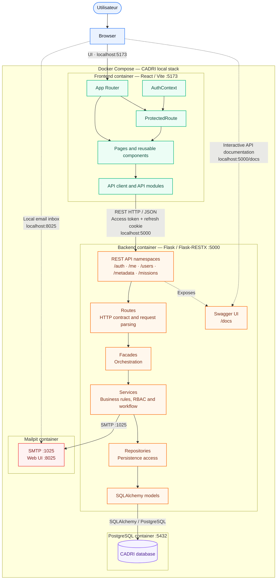
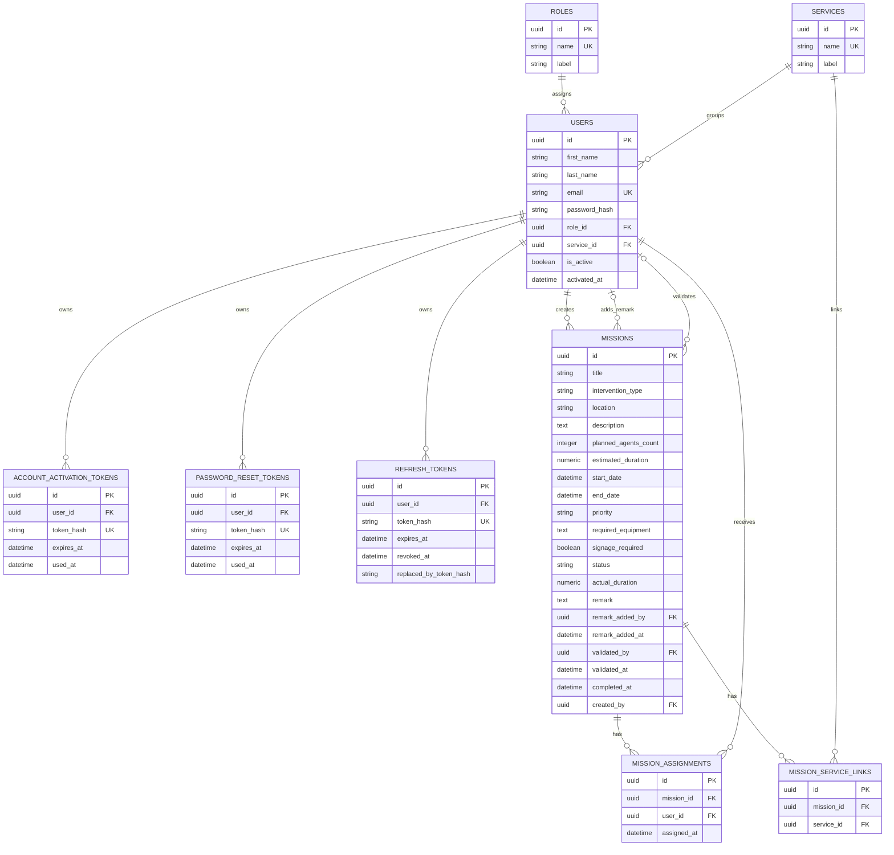
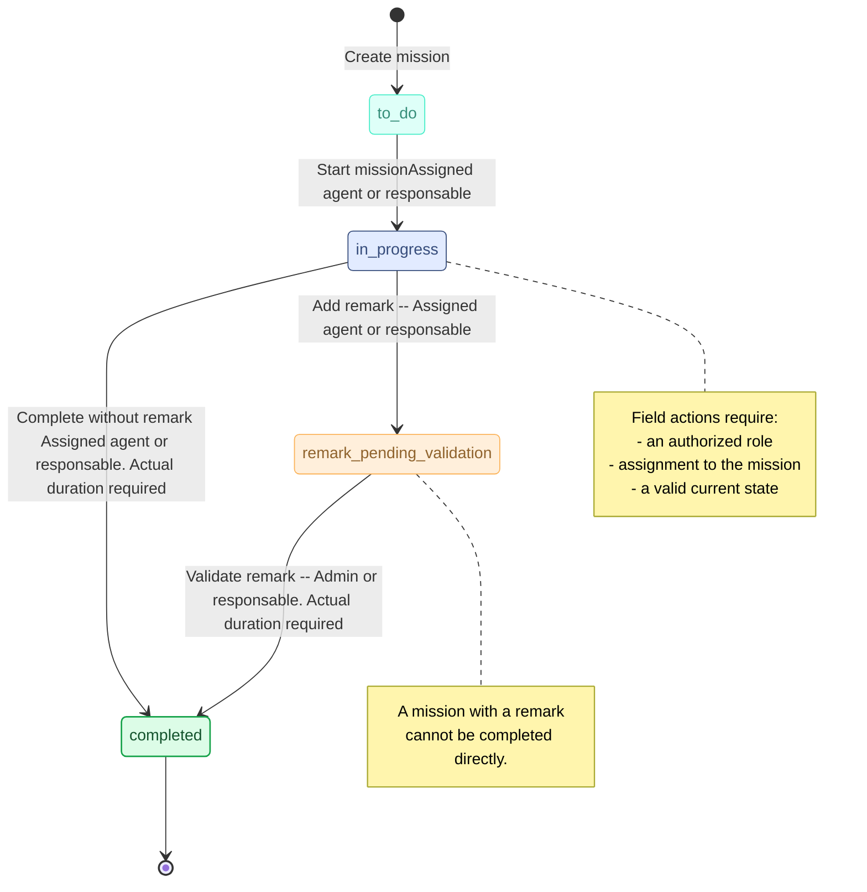

# CADRI

CADRI is an intranet MVP for planning, assigning, tracking, validating, and completing municipal field intervention missions.

The application provides a working full-stack product with a Flask REST API, a React frontend, PostgreSQL persistence, Docker Compose orchestration, Mailpit email testing, automated backend/frontend tests, and a reproducible local demo environment.

## Table of Contents

- [Project Overview](#project-overview)
- [Main Features](#main-features)
- [Roles and Permissions](#roles-and-permissions)
- [Technology Stack](#technology-stack)
- [Application Architecture](#application-architecture)
- [Database Diagram](#database-diagram)
- [Mission Lifecycle](#mission-lifecycle)
- [Repository Structure](#repository-structure)
- [Prerequisites](#prerequisites)
- [Environment Variables](#environment-variables)
- [Quick Start](#quick-start)
- [Bootstrap Script](#bootstrap-script)
- [Useful Commands](#useful-commands)
- [Default Demo Accounts](#default-demo-accounts)
- [API Overview](#api-overview)
- [Testing and QA](#testing-and-qa)
- [Security Notes](#security-notes)
- [Git and Collaboration Workflow](#git-and-collaboration-workflow)
- [Demo and Handover Checklist](#demo-and-handover-checklist)
- [Troubleshooting](#troubleshooting)

## Project Overview

CADRI helps an internal municipal team manage field missions from creation to completion.

The MVP supports:

- user authentication and account activation;
- password reset and password change flows;
- profile management;
- role-based user management;
- metadata-driven forms for roles, services, priorities, and mission statuses;
- mission creation with services, assignments, dates, duration, equipment, and signage requirements;
- mission tracking by assigned field users;
- actual duration reporting;
- field remarks;
- mission validation when a remark is present;
- mission completion;
- Docker-based local demo environment;
- automated and manual QA coverage.

This README is designed as the main technical entry point for the MVP. It includes the project scope, architecture, database structure, launch instructions, test strategy, security notes, and demo workflow.

## Main Features

### Authentication and Account Management

- Login and logout.
- Access-token based protected API requests.
- Refresh-token rotation through an HTTP-only cookie.
- Account activation through a Mailpit email link.
- Forgot-password and reset-password flow.
- Password change from the authenticated profile.
- Existing refresh tokens are revoked after password changes.

### Profile

- Authenticated users can retrieve their own profile.
- Users can update personal information.
- Unauthorized role or service changes from the profile are ignored or rejected by backend rules.

### User Management

- Admin users can manage users.
- Responsables can create agent accounts according to business rules.
- Agents cannot manage other users.
- Users can be filtered by search, role, and service.
- Pagination is available for user lists.
- Assignable users are limited to active agents and responsables.

### Mission Management

- Admins and responsables can create, update, and delete missions.
- Missions can be linked to one or more services.
- Agents and responsables can be assigned to missions.
- Estimated duration is mandatory and must be at least `1`.
- Actual duration must be greater than `0`.
- Mission dates are validated by the backend.
- Mission lists support search, status, priority, service, assignment, remark, and date filters.
- Pagination is available for mission lists.

### Field Workflow

- Assigned agents can start and track assigned missions.
- Assigned responsables can also act as field users when they are assigned.
- Assigned agents and assigned responsables can add a field remark.
- Admins cannot add field remarks because remarks represent field feedback.
- Missions with remarks must be validated before completion.
- Mission validation completes the mission when all business conditions are met.

## Roles and Permissions

| Role | Main Purpose | Important Permissions |
| --- | --- | --- |
| `admin` | Global administration | Manage users, manage missions, validate missions, access administrative workflows. |
| `responsable` | Operational manager | Create missions, manage mission definitions, create agents, validate remarks, act on assigned missions. |
| `agent` | Field user | View assigned missions, start work, enter actual duration, add a remark, complete allowed missions. |

Backend services enforce the final authorization rules. The frontend improves usability by showing or hiding actions, but the backend remains the source of truth.

## Technology Stack

### Backend

| Technology | Version / Tooling | Purpose |
| --- | --- | --- |
| Python | 3.x | Backend runtime. |
| Flask | `3.0.3` | Web application framework. |
| Flask-RESTX | `1.3.0` | REST namespaces and Swagger API documentation. |
| Flask-SQLAlchemy | `3.1.1` | ORM integration. |
| SQLAlchemy | `2.0.31` | Database models and queries. |
| Flask-Migrate / Alembic | `4.0.7` / `1.13.2` | Database migrations. |
| Flask-JWT-Extended | `4.6.0` | JWT access tokens. |
| Flask-Bcrypt | `1.0.1` | Password hashing. |
| Flask-CORS | `4.0.1` | Frontend/backend CORS integration. |
| pytest | `8.3.2` | Backend automated tests. |

### Frontend

| Technology | Version / Tooling | Purpose |
| --- | --- | --- |
| React | `18.3.1` | UI framework. |
| Vite | `5.4.10` | Frontend dev server and build tool. |
| React Router DOM | `6.28.0` | Client-side routing. |
| lucide-react | `1.17.0` | Icons. |
| Vitest | `1.6.0` | Frontend test runner. |
| Testing Library | React / jest-dom / user-event | Component and user-flow testing. |
| jsdom | `24.0.0` | DOM environment for tests. |

### Infrastructure

| Technology | Purpose |
| --- | --- |
| Docker | Containerized services. |
| Docker Compose | Local multi-service orchestration. |
| PostgreSQL 16 | Relational database. |
| Mailpit | Local email testing for activation and password reset. |
| cURL | API smoke and regression validation. |

## Application Architecture



### Backend Layering

The backend follows a clear separation of responsibilities:

- `routes`: HTTP endpoints and request parsing.
- `facades`: orchestration between routes and services.
- `services`: business rules, RBAC, validation, and workflow logic.
- `repositories`: persistence access.
- `models`: SQLAlchemy entities.
- `utils`: constants, validators, decorators, security helpers, token helpers, and custom exceptions.

This structure keeps the most important business rules outside of the HTTP layer and makes them easier to test.

### Frontend Layering

The frontend is organized around:

- pages for route-level screens;
- reusable components for layout, mission lists, user tables, password fields, and modals;
- API service modules for backend calls;
- an authentication context;
- protected routes for private application areas;
- CSS files grouped by page or component.

## Database Diagram



## Mission Lifecycle



Important rules:

- a mission can only be started from `to_do`;
- actual duration is required before completion or validation;
- a mission with a remark cannot be completed before validation;
- validating a mission with a remark completes it;
- assigned agents and assigned responsables can add remarks;
- admins and unassigned responsables cannot add field remarks.

## Repository Structure

Generated folders such as `node_modules`, `.venv`, `dist`, `__pycache__`, and pytest caches are intentionally omitted from this tree.

```text
.
├── README.md
├── docker-compose.yml
└── apps
    ├── backend
    │   ├── .env.example
    │   ├── Dockerfile
    │   ├── cadri_curl_full_test_suite.sh
    │   ├── requirements.txt
    │   ├── run.py
    │   ├── app
    │   │   ├── __init__.py
    │   │   ├── config.py
    │   │   ├── extensions.py
    │   │   ├── facades
    │   │   │   ├── auth_facade.py
    │   │   │   ├── metadata_facade.py
    │   │   │   ├── mission_facade.py
    │   │   │   └── user_facade.py
    │   │   ├── models
    │   │   │   ├── account_activation_token.py
    │   │   │   ├── base_model.py
    │   │   │   ├── mission.py
    │   │   │   ├── mission_assignment.py
    │   │   │   ├── mission_service_link.py
    │   │   │   ├── password_reset_token.py
    │   │   │   ├── refresh_token.py
    │   │   │   ├── role.py
    │   │   │   ├── service.py
    │   │   │   └── user.py
    │   │   ├── repositories
    │   │   │   ├── account_activation_token_repository.py
    │   │   │   ├── mission_assignment_repository.py
    │   │   │   ├── mission_repository.py
    │   │   │   ├── mission_service_link_repository.py
    │   │   │   ├── password_reset_token_repository.py
    │   │   │   ├── refresh_token_repository.py
    │   │   │   ├── role_repository.py
    │   │   │   ├── service_repository.py
    │   │   │   └── user_repository.py
    │   │   ├── routes
    │   │   │   ├── auth_routes.py
    │   │   │   ├── me_routes.py
    │   │   │   ├── metadata_routes.py
    │   │   │   ├── mission_routes.py
    │   │   │   └── user_routes.py
    │   │   ├── seeds
    │   │   │   └── seed_initial_data.py
    │   │   ├── services
    │   │   │   ├── auth_service.py
    │   │   │   ├── email_service.py
    │   │   │   ├── metadata_service.py
    │   │   │   ├── mission_service.py
    │   │   │   └── user_service.py
    │   │   └── utils
    │   │       ├── constants.py
    │   │       ├── decorators.py
    │   │       ├── exceptions.py
    │   │       ├── security.py
    │   │       ├── tokens.py
    │   │       └── validators.py
    │   ├── migrations
    │   │   ├── alembic.ini
    │   │   ├── env.py
    │   │   └── versions
    │   │       ├── 2e3c27ce8f10_initial_tables.py
    │   │       └── ff73bbcb94d4_add_mission_tables_and_business_.py
    │   ├── scripts
    │   │   └── bootstrap_cadri.sh
    │   └── tests
    │       ├── conftest.py
    │       ├── api
    │       │   ├── test_auth_edge_routes.py
    │       │   ├── test_auth_routes.py
    │       │   ├── test_me_edge_routes.py
    │       │   ├── test_me_routes.py
    │       │   ├── test_metadata_routes.py
    │       │   ├── test_mission_routes.py
    │       │   ├── test_mission_routes_extended.py
    │       │   ├── test_user_routes.py
    │       │   └── test_user_routes_extended.py
    │       ├── helpers
    │       │   ├── auth_helpers.py
    │       │   └── mission_helpers.py
    │       ├── integration
    │       │   ├── test_auth_service.py
    │       │   ├── test_mission_service.py
    │       │   ├── test_repositories.py
    │       │   └── test_user_service.py
    │       └── unit
    │           ├── test_models.py
    │           ├── test_token_models_edge.py
    │           ├── test_tokens.py
    │           └── test_validators.py
    └── frontend
        ├── .env.example
        ├── Dockerfile
        ├── index.html
        ├── package.json
        ├── package-lock.json
        ├── vite.config.js
        ├── vitest.config.js
        ├── vitest.setup.js
        ├── src
        │   ├── App.jsx
        │   ├── main.jsx
        │   ├── index.css
        │   ├── api
        │   │   ├── apiClient.js
        │   │   ├── authApi.js
        │   │   ├── metadataApi.js
        │   │   ├── missionsApi.js
        │   │   ├── profileApi.js
        │   │   └── usersApi.js
        │   ├── assets
        │   │   └── logo.png
        │   ├── components
        │   │   ├── common
        │   │   │   ├── Modal.jsx
        │   │   │   ├── PasswordInput.jsx
        │   │   │   ├── PasswordRequirementsModal.jsx
        │   │   │   └── ProtectedRoute.jsx
        │   │   ├── layout
        │   │   │   ├── AuthLayout.jsx
        │   │   │   ├── Layout.jsx
        │   │   │   └── Sidebar.jsx
        │   │   ├── mission
        │   │   │   ├── MissionFilters.jsx
        │   │   │   ├── MissionList.jsx
        │   │   │   └── StatusBadge.jsx
        │   │   └── user
        │   │       ├── UserFilters.jsx
        │   │       └── UserTable.jsx
        │   ├── contexts
        │   │   └── AuthContext.jsx
        │   ├── pages
        │   │   ├── ActivateAccountPage.jsx
        │   │   ├── DashboardPage.jsx
        │   │   ├── ErrorPage.jsx
        │   │   ├── ForgotPasswordPage.jsx
        │   │   ├── LoginPage.jsx
        │   │   ├── MissionDetailPage.jsx
        │   │   ├── MissionFormPage.jsx
        │   │   ├── ProfilePage.jsx
        │   │   ├── ResetPasswordPage.jsx
        │   │   ├── UserFormPage.jsx
        │   │   └── UserManagementPage.jsx
        │   ├── router
        │   │   └── AppRouter.jsx
        │   └── styles
        │       ├── AuthLayout.css
        │       ├── ConfirmModals.css
        │       ├── DashboardPage.css
        │       ├── ErrorPage.css
        │       ├── Layout.css
        │       ├── MissionDetailPage.css
        │       ├── MissionFilters.css
        │       ├── MissionFormPage.css
        │       ├── MissionList.css
        │       ├── ProfilePage.css
        │       ├── StatusBadge.css
        │       ├── UserFilters.css
        │       ├── UserManagementPage.css
        │       ├── UserTable.css
        │       └── index.css
        └── tests
            ├── README.md
            ├── auth.test.jsx
            ├── dashboard.test.jsx
            ├── errorAndRouting.test.jsx
            ├── missions.test.jsx
            ├── profile.test.jsx
            └── users.test.jsx
```

## Prerequisites

Install the following tools before running the project:

- Docker;
- Docker Compose v2;
- Git;
- Node.js and npm, only if running the frontend outside Docker;
- Python 3, only if running the backend outside Docker.

The recommended workflow uses Docker Compose.

## Environment Variables

### Backend

Create the backend environment file:

```bash
cp apps/backend/.env.example apps/backend/.env
```

Important backend variables:

| Variable | Purpose |
| --- | --- |
| `FLASK_ENV` | Runtime environment: `development`, `testing`, or `production`. |
| `SECRET_KEY` | Flask application secret. |
| `JWT_SECRET_KEY` | JWT signing secret. |
| `DATABASE_URL` | Main PostgreSQL database URL. |
| `TEST_DATABASE_URL` | Test PostgreSQL database URL. |
| `FRONTEND_URL` | Allowed frontend origin for CORS. |
| `MAIL_SERVER` | Mail server host. Docker uses `mailpit`. |
| `MAIL_PORT` | Mail server port. Docker uses `1025`. |
| `JWT_ACCESS_TOKEN_EXPIRES_MINUTES` | Access token lifetime. |
| `REFRESH_TOKEN_EXPIRES_DAYS` | Refresh token lifetime. |
| `REFRESH_COOKIE_NAME` | Refresh cookie name. |
| `REFRESH_COOKIE_PATH` | Refresh cookie path. |
| `REFRESH_COOKIE_SECURE` | Set to `true` for HTTPS production. |
| `REFRESH_COOKIE_SAMESITE` | Cookie SameSite policy. |

### Frontend

Create the frontend environment file if you run Vite outside Docker:

```bash
cp apps/frontend/.env.example apps/frontend/.env
```

| Variable | Purpose |
| --- | --- |
| `VITE_API_BASE_URL` | Backend API base URL. Default: `http://localhost:5000`. |

## Quick Start

### Recommended: Bootstrap Everything

From the repository root:

```bash
./apps/backend/scripts/bootstrap_cadri.sh
```

The application will be available at:

| Service | URL |
| --- | --- |
| Frontend | http://localhost:5173 |
| Backend | http://localhost:5000 |
| Swagger API docs | http://localhost:5000/docs |
| Mailpit | http://localhost:8025 |

### Manual Docker Start

If the databases are already prepared:

```bash
docker compose up --build -d
```

Apply migrations:

```bash
docker compose exec backend flask db upgrade
```

Seed development data:

```bash
docker compose exec backend python -c "from app import create_app; from app.seeds import run_seed; app = create_app(); app.app_context().push(); run_seed()"
```

Stop the stack:

```bash
docker compose down
```

Stop and remove volumes:

```bash
docker compose down -v
```

## Bootstrap Script

The bootstrap script is located at:

```text
apps/backend/scripts/bootstrap_cadri.sh
```

It performs the full local setup:

1. locates the project root by finding `docker-compose.yml`;
2. starts Docker containers with `docker compose up --build -d`;
3. waits until PostgreSQL is ready;
4. creates the `cadri_test_db` test database if it does not exist;
5. runs migrations on the development database;
6. seeds the development database;
7. runs migrations on the test database;
8. seeds the test database;
9. verifies that roles, services, and default users exist;
10. compiles backend Python files with `compileall`;
11. prints service URLs, default accounts, and test commands.

Use the bootstrap script before demos, local QA checks, or development environment resets.

## Useful Commands

### Docker

```bash
docker compose up --build -d
docker compose ps
docker compose logs -f backend
docker compose logs -f frontend
docker compose down
docker compose down -v
```

### Backend

```bash
docker compose exec backend flask db upgrade
docker compose exec backend pytest -v
docker compose exec backend python -m compileall app tests
```

Run the cURL smoke suite:

```bash
cd apps/backend
./cadri_curl_full_test_suite.sh
```

### Frontend

```bash
cd apps/frontend
npm install
npm run dev
npm test
npm run test:coverage
npm run build
```

When using Docker Compose, the frontend container already runs Vite on port `5173`.

## Default Demo Accounts

The seed data creates the following users:

| Role | Email | Password |
| --- | --- | --- |
| Admin | `admin@cadri.local` | `StrongPass1` |
| Responsable | `responsable@cadri.local` | `StrongPass1` |
| Agent | `agent@cadri.local` | `StrongPass1` |

These accounts are intended for local development, QA, and demo workflows only.

## API Overview

Swagger documentation is available at:

```text
http://localhost:5000/docs
```

Main API namespaces:

| Namespace | Purpose |
| --- | --- |
| `/auth` | Login, logout, refresh, account activation, forgot/reset password, change password. |
| `/me` | Current authenticated user profile. |
| `/users` | User management, filters, pagination, assignable users. |
| `/metadata` | Roles, services, priorities, statuses. |
| `/missions` | Mission CRUD, filters, status updates, actual duration, remarks, validation, completion. |

Important mission endpoints:

| Method | Endpoint | Purpose |
| --- | --- | --- |
| `GET` | `/missions` | List missions with filters and pagination. |
| `POST` | `/missions` | Create a mission. |
| `GET` | `/missions/<mission_id>` | Get mission details. |
| `PATCH` | `/missions/<mission_id>` | Update mission definition. |
| `DELETE` | `/missions/<mission_id>` | Delete a mission. |
| `PATCH` | `/missions/<mission_id>/status` | Start a mission. |
| `PATCH` | `/missions/<mission_id>/actual-duration` | Set actual duration. |
| `POST` | `/missions/<mission_id>/remark` | Add a field remark. |
| `POST` | `/missions/<mission_id>/validate` | Validate a mission with a remark. |
| `POST` | `/missions/<mission_id>/complete` | Complete a mission when allowed. |

## Testing and QA

### Backend Tests

Run backend tests through Docker:

```bash
docker compose exec backend pytest -v
```

Backend tests cover:

- authentication routes;
- current user profile routes;
- metadata routes;
- user routes;
- mission routes;
- auth service integration;
- user service integration;
- mission service integration;
- repositories;
- model behavior;
- token behavior;
- validators;
- mission workflow regressions.

The current backend QA report records `126` passing backend tests.

### Frontend Tests

Run frontend tests:

```bash
cd apps/frontend
npm test
```

Generate coverage:

```bash
cd apps/frontend
npm run test:coverage
```

Frontend tests cover:

| File | Scope |
| --- | --- |
| `auth.test.jsx` | Login, errors, forgot/reset password, account activation. |
| `dashboard.test.jsx` | Rendering, filters, navigation, role-based display. |
| `missions.test.jsx` | Detail view, create/edit form, role restrictions, delete. |
| `users.test.jsx` | List, filters, create/view/edit/delete, role restrictions. |
| `profile.test.jsx` | Rendering, settings, password change, logout. |
| `errorAndRouting.test.jsx` | Error pages, protected routes, unknown routes. |

The frontend test documentation references `74` tests.

### cURL Smoke and Regression Suite

Run:

```bash
cd apps/backend
./cadri_curl_full_test_suite.sh
```

The cURL suite validates real HTTP behavior, including:

- authentication;
- cookies and refresh token behavior;
- activation/reset token flows;
- protected routes;
- mission workflow and authorization;
- regression checks around mission remarks.

### Manual QA

Manual validation covers:

- admin, responsable, and agent login;
- user creation;
- account activation through Mailpit;
- password reset;
- profile update;
- mission creation;
- mission assignment visibility;
- mission filters and pagination;
- status updates;
- actual duration update;
- mission completion without remark;
- remark creation by assigned agent;
- remark creation by assigned responsable;
- access control for remarks;
- remark validation;
- mission and user deletion;
- logout and session refresh behavior.

## Security Notes

CADRI implements several security-oriented controls:

- passwords are hashed with Bcrypt;
- raw passwords are never stored;
- access tokens are short-lived;
- refresh tokens are stored in HTTP-only cookies;
- refresh tokens are rotated;
- refresh tokens are revoked after logout and password changes;
- activation and reset tokens are validated and consumed;
- RBAC is enforced in backend services;
- mission actions verify role, assignment, and mission state;
- backend validation protects against invalid dates, invalid durations, missing services, inactive assignments, and unauthorized role changes.

For production use, set:

- strong `SECRET_KEY` and `JWT_SECRET_KEY`;
- HTTPS;
- `REFRESH_COOKIE_SECURE=true`;
- production database credentials;
- production-ready email configuration;
- restricted CORS origin;
- proper logging and monitoring.

## Git and Collaboration Workflow

The project uses GitHub as the source repository and `develop` as the integration branch.

Recommended workflow:

1. create a feature or fix branch from `develop`;
2. implement a focused change;
3. run relevant tests;
4. review changed files before committing;
5. write clear commit messages;
6. merge through a pull request or controlled merge into `develop`;
7. keep documentation and tests aligned with delivered behavior.

Examples of meaningful commit categories:

- `feat:` for new features;
- `fix:` for bug fixes;
- `test:` for test additions or updates;
- `docs:` for documentation;
- `style:` for styling-only changes;
- `refactor:` for internal code changes without behavior changes.

## Demo and Handover Checklist

For a technical demo or project handover, be ready to present:

- the functional MVP through Docker Compose;
- the GitHub repository;
- the root README;
- the application architecture diagram;
- the database diagram;
- backend and frontend technical concepts;
- authentication and token flow;
- password hashing;
- RBAC and mission permissions;
- mission lifecycle;
- test strategy and test commands;
- cURL smoke suite;
- bug tracking and resolved critical issues;
- the Docker Compose demo environment.

## Troubleshooting

### PostgreSQL is not ready

Wait a few seconds and check container status:

```bash
docker compose ps
docker compose logs -f db
```

The bootstrap script waits for PostgreSQL automatically.

### Backend cannot connect to the database

Check `apps/backend/.env` and confirm that Docker uses:

```text
DATABASE_URL=postgresql://cadri_user:cadri_password@db:5432/cadri_db
```

Inside Docker Compose, the database host is `db`, not `localhost`.

### Frontend cannot reach the backend

Check:

```text
VITE_API_BASE_URL=http://localhost:5000
```

Then restart the frontend container or Vite dev server.

### Emails do not appear

Open Mailpit:

```text
http://localhost:8025
```

Check backend mail variables:

```text
MAIL_SERVER=mailpit
MAIL_PORT=1025
```

### Reset the local environment

This removes containers and volumes, including PostgreSQL data:

```bash
docker compose down -v
./apps/backend/scripts/bootstrap_cadri.sh
```

## License

This repository contains the CADRI MVP application.

## Authors

Morgane Abbattista and Nicolas Dasilva