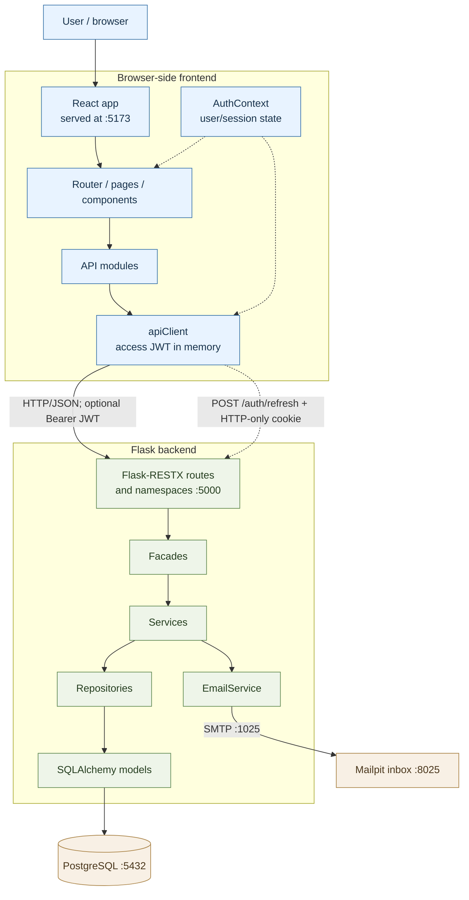
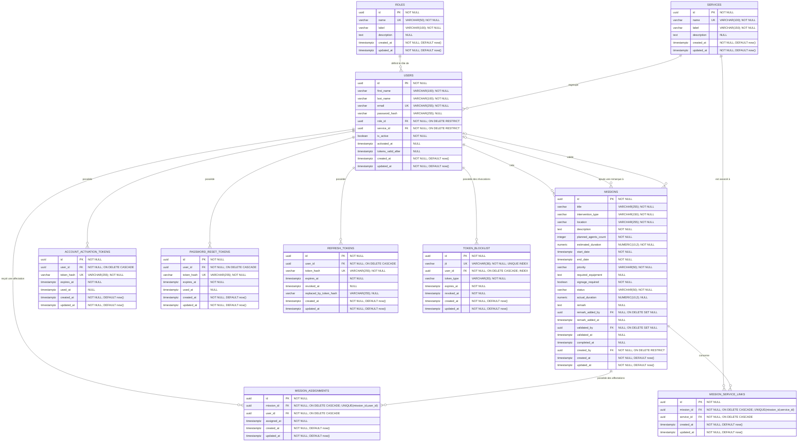
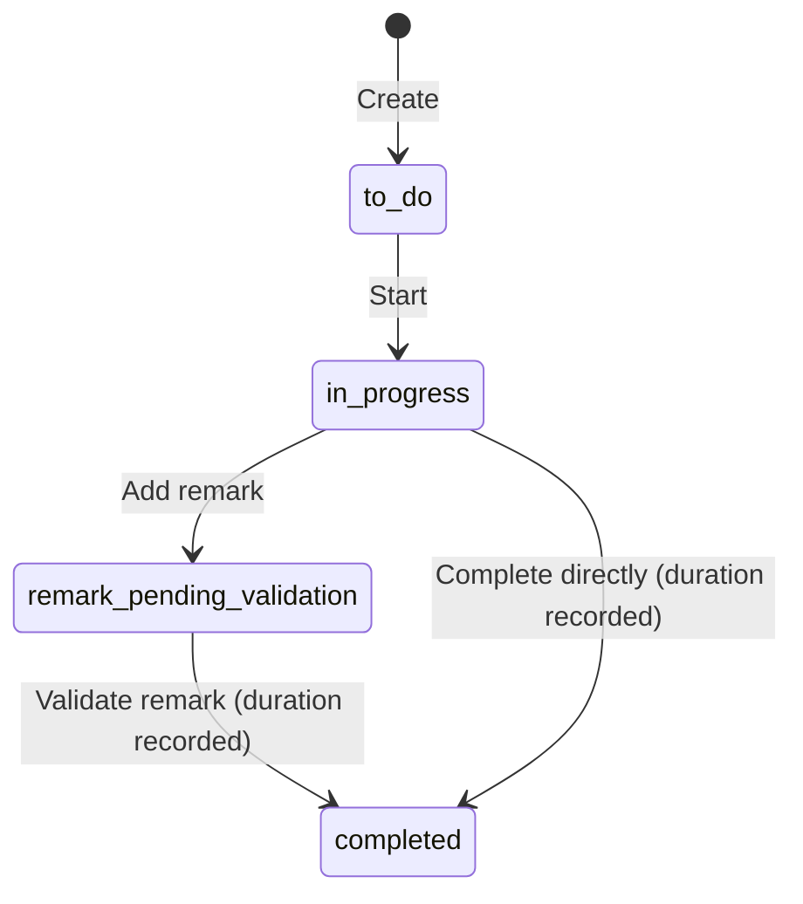
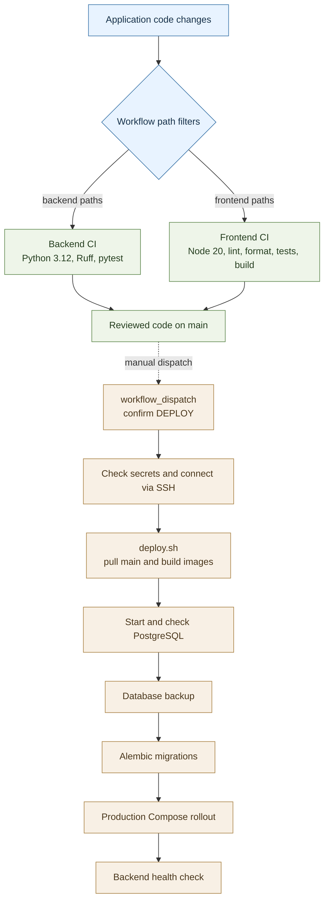
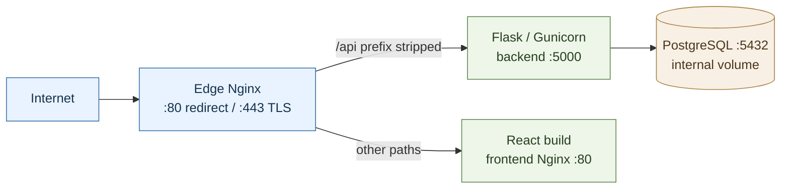

# CADRI

CADRI is an intranet application for municipal technical services to plan, assign, track, validate, and complete field intervention missions. It combines a Flask REST API, a React interface, PostgreSQL persistence, local email testing, automated tests, and Docker Compose workflows. A production deployment configuration is included, but CADRI is not currently hosted on a production server.

## Table of Contents

- [Project Overview](#project-overview)
- [Main Features](#main-features)
- [Roles and Permissions](#roles-and-permissions)
- [Technology Stack](#technology-stack)
- [Application Architecture](#application-architecture)
- [Database Diagram](#database-diagram)
- [Mission Lifecycle](#mission-lifecycle)
- [Repository Structure](#repository-structure)
- [Prerequisites](#prerequisites)
- [Environment Variables](#environment-variables)
- [Quick Start](#quick-start)
- [Bootstrap Script](#bootstrap-script)
- [Useful Commands](#useful-commands)
- [Default Demo Accounts](#default-demo-accounts)
- [API Overview](#api-overview)
- [Testing and QA](#testing-and-qa)
- [CI/CD](#cicd)
- [Production Deployment](#production-deployment)
- [Security Notes](#security-notes)
- [Git and Collaboration Workflow](#git-and-collaboration-workflow)
- [Demo and Handover Checklist](#demo-and-handover-checklist)
- [Troubleshooting](#troubleshooting)
- [License](#license)
- [Authors](#authors)

## Project Overview

CADRI follows a mission from its creation through field work and completion. Municipal services define the work, assign active agents or managers, record actual duration and remarks, and review remarks before final validation. The interface provides role-aware screens; the backend enforces the permissions and workflow rules.

The local stack consists of a Vite-served React frontend, a Flask-RESTX API, PostgreSQL 16, and Mailpit for viewing activation and password-reset emails. Swagger is available for the detailed HTTP contract. A separate production configuration provides containerized services, a TLS reverse proxy, deployment scripts, and a manual deployment workflow; it is a prepared configuration, not an active hosting claim.

## Main Features

### Authentication and Account Management

- Login returns a short-lived access JWT and sets an opaque refresh token in an HTTP-only cookie.
- The frontend keeps the access token in memory and automatically calls `/auth/refresh` after an eligible 401 response. The refresh token rotates on use.
- Logout revokes the available access-token JTI and refresh session; login revokes previous refresh sessions for that user.
- New accounts receive a one-time activation link. Active accounts can request a password-reset link and authenticated users can change their password.
- Password changes and resets invalidate earlier access tokens and revoke refresh sessions.

### Profile

- Authenticated users can read and update their own name and email through `/me`.
- Changing a role or service requires the separate admin user-management flow; the own-profile API accepts only personal fields.
- The frontend restores a cached user view only after the backend confirms the session.

### User Management

- Admins list users with search, role and service filters, pagination, and read/update/delete user records.
- Admins can create accounts for all three roles; responsables can create agent accounts only. New accounts receive an activation email.
- Admins and responsables can request the list of active, assignable agents and responsables.
- A user with no created missions can be physically deleted by an admin. If the user created a mission, the API returns `409 Conflict` before deleting any user or token data. This preserves the mission history and the required `Mission.created_by` reference (`ON DELETE RESTRICT`). The frontend closes the confirmation dialog and shows a dedicated French explanation.

### Mission Management

- Admins and responsables create, update, and delete mission definitions, including services and assignments.
- A mission has at least one linked service. Only active agents and responsables may be assigned.
- Estimated duration is at least one hour; actual duration, when entered, must be positive. The backend validates date order and compatible timezone information.
- Mission lists support search, status, priority, service, own-assignment, remark, and date filters with pagination. Agents see only assigned missions; managers can optionally request only their own assignments.

### Field Workflow

- Missions begin in `to_do`, move to `in_progress`, then either complete directly or enter `remark_pending_validation`.
- Actual duration can be entered while work is in progress or awaiting remark validation.
- An assigned agent or responsable may add one remark to an in-progress mission. An admin or responsable validates a remarked mission after actual duration has been recorded; validation completes it.
- An in-progress mission without a remark can be completed directly once actual duration is present. Completed missions do not accept further workflow transitions.

## Roles and Permissions

These are backend rules from `UserService` and `MissionService`. Frontend controls guide users but do not grant permissions.

| Action | Admin | Responsable | Agent |
| --- | --- | --- | --- |
| List all users | Yes | No | No |
| Create user | Any of the three roles | Agent only | No |
| Read user details | Any user | Own record via API | Own record via API |
| Update or delete another user | Yes, subject to the creator deletion rule | No | No |
| Read/update own profile | Yes | Yes | Yes |
| List assignable users | Yes | Yes | No |
| List/view missions | All | All | Assigned missions only |
| Create/update/delete mission definitions | Yes | Yes | No |
| Start a `to_do` mission | Yes | Yes | Only if assigned |
| Set actual duration | Yes | Yes | Only if assigned |
| Add a field remark | No | Only if assigned | Only if assigned |
| Validate a pending remark | Yes | Yes | No |
| Complete directly without a remark | Yes | Yes | Only if assigned |

Starting, setting duration, and direct completion use the general workflow permission check: admins and responsables do not need an assignment for those actions. Remark creation has a stricter assignment rule for responsables as well as agents. Validation is available to admins and responsables without an assignment. The allowed mission state and required duration are checked separately for each action.

An admin deletion request for a mission creator returns `409 Conflict`; the user, missions, and tokens remain intact. A non-creator can still be deleted normally. The mission creator foreign key is non-null and restricted, so missions are not automatically removed by user deletion.

## Technology Stack

Versions below are declared in the repository's dependency files, Dockerfiles, or CI workflows.

### Backend

| Technology | Declared version | Purpose |
| --- | --- | --- |
| Python | 3.12 | Runtime in both backend Dockerfiles and backend CI. |
| Flask | 3.0.3 | Application factory and HTTP server. |
| Flask-RESTX | 1.3.0 | Namespaces, request models, and Swagger UI. |
| Flask-SQLAlchemy / SQLAlchemy | 3.1.1 / 2.0.31 | ORM and PostgreSQL access. |
| Flask-Migrate / Alembic | 4.0.7 / 1.13.2 | Schema migrations. |
| Flask-JWT-Extended | 4.6.0 | Access JWTs and validation. |
| Flask-Bcrypt | 1.0.1 | Password hashing. |
| Flask-CORS | 4.0.1 | Configured frontend origin and credentialed requests. |
| psycopg2-binary | 2.9.9 | PostgreSQL driver. |
| pytest / Ruff | 8.3.2 / 0.16.7 | Backend tests and lint/format checks; Ruff is in `requirements-dev.txt`. |

### Frontend

| Technology | Declared version | Purpose |
| --- | --- | --- |
| Node.js | 20 | Vite development container, production build stage, and frontend CI. |
| React / React DOM | ^18.3.1 | User interface. |
| Vite | ^5.4.10 | Development server and production build. |
| React Router DOM | ^6.28.0 | Client-side routing. |
| lucide-react | ^1.17.0 | Icons. |
| Vitest / jsdom | ^1.6.0 / ^24.0.0 | Component test runner and DOM. |
| Testing Library | React ^15.0.0, jest-dom ^6.4.0, user-event ^14.5.0 | UI behavior tests. |
| ESLint / Prettier | ^10.10.0 / ^3.9.6 | Static checks and formatting. |

### Infrastructure

| Technology | Declared version or source | Purpose |
| --- | --- | --- |
| Docker Compose | v2 CLI | Local and production-oriented service orchestration. |
| PostgreSQL | 16 | Relational persistence. |
| Mailpit | `axllent/mailpit:latest` | Local and CI SMTP inbox. |
| Gunicorn | 23.0.0 | Production backend WSGI server. |
| Nginx | 1.27-alpine | Production frontend static server and edge reverse proxy. |
| GitHub Actions | Workflow files in `.github/workflows/` | Backend/frontend CI and manual deployment. |
| cURL | Host tool | HTTP smoke and regression suite. |

## Application Architecture

The diagram represents local development through `docker-compose.yml`. Docker service names resolve inside the Compose network; the browser reaches the published host ports.


```mermaid
flowchart TB
    Browser["User / browser"] --> React["React app<br/>served at :5173"]
    subgraph Frontend["Browser-side frontend"]
        direction TB
        React --> UI["Router / pages / components"]
        UI --> API["API modules"]
        API --> Client["apiClient<br/>access JWT in memory"]
        Auth["AuthContext<br/>user/session state"] -.-> UI
        Auth -.-> Client
    end
    Client -->|"HTTP/JSON; optional Bearer JWT"| Routes["Flask-RESTX routes<br/>and namespaces :5000"]
    Client -.->|"POST /auth/refresh + HTTP-only cookie"| Routes
    subgraph Backend["Flask backend"]
        direction TB
        Routes --> Facades["Facades"]
        Facades --> Services["Services"]
        Services --> Repositories["Repositories"]
        Repositories --> Models["SQLAlchemy models"]
        Services --> Email["EmailService"]
    end
    Models --> DB[("PostgreSQL :5432")]
    Email -->|"SMTP :1025"| Mail["Mailpit inbox :8025"]
    classDef frontend fill:#e8f3ff,stroke:#3973a9,color:#17324d;
    classDef backend fill:#eef5e9,stroke:#60894f,color:#263f20;
    classDef infra fill:#f8f0e5,stroke:#a98245,color:#4b371c;
    class Browser,React,UI,API,Client,Auth frontend;
    class Routes,Facades,Services,Repositories,Models,Email backend;
    class DB,Mail infra;
```

`apiClient` attaches the in-memory access JWT to protected requests. The browser sends the HTTP-only refresh cookie with `/auth/refresh`; the backend rotates that cookie and returns a new access token. `AuthContext` holds user/session state and revalidates a restored session. API responses and errors pass through the centralized client.

### Backend Layering

- `routes/` defines Flask-RESTX resources and namespaces, parses HTTP input, and maps application errors to status codes. The application factory registers those namespaces at `/auth`, `/me`, `/users`, `/metadata`, and `/missions`.
- `facades/` exposes a narrow orchestration boundary to routes.
- `services/` enforces validation, RBAC, authentication, and mission state transitions.
- `repositories/` handles queries and persistence; `models/` defines SQLAlchemy entities.
- `utils/` contains constants, validators, security/token helpers, and application errors; `seeds/` supplies local demonstration data.

### Frontend Layering

- `router/AppRouter.jsx` maps public and protected routes to `pages/`.
- `components/` supplies common dialogs, layout, mission views, and user controls. `hooks/` shares form, pagination, metadata, accessibility, and title behavior.
- `contexts/AuthContext.jsx` manages authenticated user state. `api/` modules map product data and use the central `apiClient.js` for HTTP requests and session renewal.
- `styles/` and `assets/` hold presentation files. Frontend tests exercise visible page and session behavior.

## Database Diagram

All entities use a UUID primary key and inherited creation/update timestamps. The ERD below documents the modeled tables and foreign-key deletion rules.


```mermaid
erDiagram
    direction TB

    ROLES ||--o{ USERS : "définit le rôle de"
    SERVICES ||--o{ USERS : "regroupe"
    USERS ||--o{ MISSIONS : "crée"
    USERS o|--o{ MISSIONS : "ajoute une remarque à"
    USERS o|--o{ MISSIONS : "valide"
    USERS ||--o{ MISSION_ASSIGNMENTS : "reçoit une affectation"
    MISSIONS ||--o{ MISSION_ASSIGNMENTS : "possède des affectations"
    SERVICES ||--o{ MISSION_SERVICE_LINKS : "est associé à"
    MISSIONS ||--o{ MISSION_SERVICE_LINKS : "concerne"
    USERS ||--o{ ACCOUNT_ACTIVATION_TOKENS : "possède"
    USERS ||--o{ PASSWORD_RESET_TOKENS : "possède"
    USERS ||--o{ REFRESH_TOKENS : "possède"
    USERS ||--o{ TOKEN_BLOCKLIST : "possède des révocations"

    ROLES {
        uuid id PK "NOT NULL"
        varchar name UK "VARCHAR(50); NOT NULL"
        varchar label "VARCHAR(100); NOT NULL"
        text description "NULL"
        timestamptz created_at "NOT NULL; DEFAULT now()"
        timestamptz updated_at "NOT NULL; DEFAULT now()"
    }

    SERVICES {
        uuid id PK "NOT NULL"
        varchar name UK "VARCHAR(100); NOT NULL"
        varchar label "VARCHAR(150); NOT NULL"
        text description "NULL"
        timestamptz created_at "NOT NULL; DEFAULT now()"
        timestamptz updated_at "NOT NULL; DEFAULT now()"
    }

    USERS {
        uuid id PK "NOT NULL"
        varchar first_name "VARCHAR(100); NOT NULL"
        varchar last_name "VARCHAR(100); NOT NULL"
        varchar email UK "VARCHAR(255); NOT NULL"
        varchar password_hash "VARCHAR(255); NULL"
        uuid role_id FK "NOT NULL; ON DELETE RESTRICT"
        uuid service_id FK "NOT NULL; ON DELETE RESTRICT"
        boolean is_active "NOT NULL"
        timestamptz activated_at "NULL"
        timestamptz tokens_valid_after "NULL"
        timestamptz created_at "NOT NULL; DEFAULT now()"
        timestamptz updated_at "NOT NULL; DEFAULT now()"
    }

    MISSIONS {
        uuid id PK "NOT NULL"
        varchar title "VARCHAR(255); NOT NULL"
        varchar intervention_type "VARCHAR(150); NOT NULL"
        varchar location "VARCHAR(255); NOT NULL"
        text description "NOT NULL"
        integer planned_agents_count "NOT NULL"
        numeric estimated_duration "NUMERIC(10,2); NOT NULL"
        timestamptz start_date "NOT NULL"
        timestamptz end_date "NOT NULL"
        varchar priority "VARCHAR(50); NOT NULL"
        text required_equipment "NULL"
        boolean signage_required "NOT NULL"
        varchar status "VARCHAR(50); NOT NULL"
        numeric actual_duration "NUMERIC(10,2); NULL"
        text remark "NULL"
        uuid remark_added_by FK "NULL; ON DELETE SET NULL"
        timestamptz remark_added_at "NULL"
        uuid validated_by FK "NULL; ON DELETE SET NULL"
        timestamptz validated_at "NULL"
        timestamptz completed_at "NULL"
        uuid created_by FK "NOT NULL; ON DELETE RESTRICT"
        timestamptz created_at "NOT NULL; DEFAULT now()"
        timestamptz updated_at "NOT NULL; DEFAULT now()"
    }

    MISSION_ASSIGNMENTS {
        uuid id PK "NOT NULL"
        uuid mission_id FK "NOT NULL; ON DELETE CASCADE; UNIQUE(mission_id,user_id)"
        uuid user_id FK "NOT NULL; ON DELETE CASCADE"
        timestamptz assigned_at "NOT NULL"
        timestamptz created_at "NOT NULL; DEFAULT now()"
        timestamptz updated_at "NOT NULL; DEFAULT now()"
    }

    MISSION_SERVICE_LINKS {
        uuid id PK "NOT NULL"
        uuid mission_id FK "NOT NULL; ON DELETE CASCADE; UNIQUE(mission_id,service_id)"
        uuid service_id FK "NOT NULL; ON DELETE CASCADE"
        timestamptz created_at "NOT NULL; DEFAULT now()"
        timestamptz updated_at "NOT NULL; DEFAULT now()"
    }

    ACCOUNT_ACTIVATION_TOKENS {
        uuid id PK "NOT NULL"
        uuid user_id FK "NOT NULL; ON DELETE CASCADE"
        varchar token_hash UK "VARCHAR(255); NOT NULL"
        timestamptz expires_at "NOT NULL"
        timestamptz used_at "NULL"
        timestamptz created_at "NOT NULL; DEFAULT now()"
        timestamptz updated_at "NOT NULL; DEFAULT now()"
    }

    PASSWORD_RESET_TOKENS {
        uuid id PK "NOT NULL"
        uuid user_id FK "NOT NULL; ON DELETE CASCADE"
        varchar token_hash UK "VARCHAR(255); NOT NULL"
        timestamptz expires_at "NOT NULL"
        timestamptz used_at "NULL"
        timestamptz created_at "NOT NULL; DEFAULT now()"
        timestamptz updated_at "NOT NULL; DEFAULT now()"
    }

    REFRESH_TOKENS {
        uuid id PK "NOT NULL"
        uuid user_id FK "NOT NULL; ON DELETE CASCADE"
        varchar token_hash UK "VARCHAR(255); NOT NULL"
        timestamptz expires_at "NOT NULL"
        timestamptz revoked_at "NULL"
        varchar replaced_by_token_hash "VARCHAR(255); NULL"
        timestamptz created_at "NOT NULL; DEFAULT now()"
        timestamptz updated_at "NOT NULL; DEFAULT now()"
    }

    TOKEN_BLOCKLIST {
        uuid id PK "NOT NULL"
        varchar jti UK "VARCHAR(36); NOT NULL; UNIQUE INDEX"
        uuid user_id FK "NOT NULL; ON DELETE CASCADE; INDEX"
        varchar token_type "VARCHAR(20); NOT NULL"
        timestamptz expires_at "NOT NULL"
        timestamptz revoked_at "NOT NULL"
        timestamptz created_at "NOT NULL; DEFAULT now()"
        timestamptz updated_at "NOT NULL; DEFAULT now()"
    }
```

## Mission Lifecycle


```mermaid
stateDiagram-v2
    direction TB
    [*] --> to_do: Create
    to_do --> in_progress: Start
    in_progress --> remark_pending_validation: Add remark
    remark_pending_validation --> completed: Validate remark (duration recorded)
    in_progress --> completed: Complete directly (duration recorded)
    classDef todo fill:#fff4d6,stroke:#a87521,color:#5c4014;
    classDef active fill:#e7f2ff,stroke:#4779a8,color:#183d61;
    classDef review fill:#f1eafb,stroke:#8061a6,color:#402a60;
    classDef done fill:#e5f4e8,stroke:#49875a,color:#1e4d2a;
    class to_do todo;
    class in_progress active;
    class remark_pending_validation review;
    class completed done;
```

`MissionService` permits only `to_do → in_progress` through the status endpoint. Actual duration is entered while `in_progress` or `remark_pending_validation` and must be greater than zero. Only an assigned agent or responsable may add a remark, and only from `in_progress`. A remark moves the mission to `remark_pending_validation`. An admin or responsable can validate it once actual duration exists; validation records the validator and completes the mission. Direct completion requires `in_progress`, actual duration, and no unvalidated remark. Agents must be assigned for start, duration, and direct completion; admins and responsables may perform those actions without an assignment. No endpoint reopens a completed mission.

## Repository Structure

This tree shows selected tracked source and operational files. Generated assets, local environments, private `.env` files, backups, and certificates are omitted.

```text
.
├── README.md
├── .env.production.example
├── .github/
│   └── workflows/
│       ├── backend-ci.yml
│       ├── frontend-ci.yml
│       └── deploy.yml
├── docker-compose.yml
├── docker-compose.prod.yml
├── deploy/
│   └── nginx/nginx.conf
├── scripts/
│   ├── deploy.sh
│   ├── migrate.sh
│   ├── backup_db.sh
│   ├── restore_db.sh
│   └── rollback.sh
└── apps/
    ├── backend/
    │   ├── .env.example
    │   ├── Dockerfile
    │   ├── Dockerfile.prod
    │   ├── requirements.txt
    │   ├── requirements-dev.txt
    │   ├── pyproject.toml
    │   ├── run.py
    │   ├── cadri_curl_full_test_suite.sh
    │   ├── scripts/bootstrap_cadri.sh
    │   ├── app/
    │   │   ├── __init__.py
    │   │   ├── config.py
    │   │   ├── extensions.py
    │   │   ├── facades/
    │   │   │   ├── auth_facade.py
    │   │   │   ├── metadata_facade.py
    │   │   │   ├── mission_facade.py
    │   │   │   └── user_facade.py
    │   │   ├── models/
    │   │   │   ├── base_model.py
    │   │   │   ├── user.py
    │   │   │   ├── role.py
    │   │   │   ├── service.py
    │   │   │   ├── mission.py
    │   │   │   ├── mission_assignment.py
    │   │   │   ├── mission_service_link.py
    │   │   │   ├── account_activation_token.py
    │   │   │   ├── password_reset_token.py
    │   │   │   ├── refresh_token.py
    │   │   │   └── token_blocklist.py
    │   │   ├── repositories/
    │   │   │   ├── user_repository.py
    │   │   │   ├── role_repository.py
    │   │   │   ├── service_repository.py
    │   │   │   ├── mission_repository.py
    │   │   │   ├── mission_assignment_repository.py
    │   │   │   ├── mission_service_link_repository.py
    │   │   │   ├── account_activation_token_repository.py
    │   │   │   ├── password_reset_token_repository.py
    │   │   │   ├── refresh_token_repository.py
    │   │   │   └── token_blocklist_repository.py
    │   │   ├── routes/
    │   │   │   ├── auth_routes.py
    │   │   │   ├── me_routes.py
    │   │   │   ├── user_routes.py
    │   │   │   ├── metadata_routes.py
    │   │   │   └── mission_routes.py
    │   │   ├── seeds/seed_initial_data.py
    │   │   ├── services/
    │   │   │   ├── auth_service.py
    │   │   │   ├── email_service.py
    │   │   │   ├── metadata_service.py
    │   │   │   ├── mission_service.py
    │   │   │   └── user_service.py
    │   │   └── utils/
    │   │       ├── constants.py
    │   │       ├── exceptions.py
    │   │       ├── security.py
    │   │       ├── tokens.py
    │   │       └── validators.py
    │   ├── migrations/
    │   │   ├── env.py
    │   │   └── versions/
    │   │       ├── 2e3c27ce8f10_initial_tables.py
    │   │       ├── ff73bbcb94d4_add_mission_tables_and_business_.py
    │   │       └── 8d3e1f4a6b72_add_access_token_revocation.py
    │   └── tests/
    │       ├── conftest.py
    │       ├── api/
    │       │   ├── test_access_token_revocation.py
    │       │   ├── test_auth_routes.py
    │       │   ├── test_mission_routes.py
    │       │   ├── test_mission_routes_extended.py
    │       │   ├── test_user_routes.py
    │       │   └── test_user_routes_extended.py
    │       ├── helpers/
    │       │   ├── auth_helpers.py
    │       │   └── mission_helpers.py
    │       ├── integration/
    │       │   ├── test_auth_concurrency.py
    │       │   ├── test_auth_service.py
    │       │   ├── test_mission_concurrency.py
    │       │   ├── test_mission_service.py
    │       │   ├── test_repositories.py
    │       │   └── test_user_service.py
    │       └── unit/
    │           ├── test_models.py
    │           ├── test_token_models_edge.py
    │           ├── test_tokens.py
    │           └── test_validators.py
    └── frontend/
        ├── .env.example
        ├── Dockerfile
        ├── Dockerfile.prod
        ├── package.json
        ├── package-lock.json
        ├── index.html
        ├── eslint.config.js
        ├── vite.config.js
        ├── vitest.config.js
        ├── vitest.setup.js
        ├── src/
        │   ├── App.jsx
        │   ├── main.jsx
        │   ├── api/
        │   │   ├── apiClient.js
        │   │   ├── authApi.js
        │   │   ├── metadataApi.js
        │   │   ├── missionsApi.js
        │   │   ├── profileApi.js
        │   │   └── usersApi.js
        │   ├── assets/logo.png
        │   ├── components/
        │   │   ├── common/
        │   │   │   ├── AlertModal.jsx
        │   │   │   ├── ConfirmModal.jsx
        │   │   │   ├── ProtectedRoute.jsx
        │   │   │   └── PasswordInput.jsx
        │   │   ├── layout/
        │   │   │   ├── AuthLayout.jsx
        │   │   │   ├── Layout.jsx
        │   │   │   └── Sidebar.jsx
        │   │   ├── mission/
        │   │   │   ├── MissionFilters.jsx
        │   │   │   ├── MissionList.jsx
        │   │   │   └── StatusBadge.jsx
        │   │   └── user/
        │   │       ├── UserFilters.jsx
        │   │       └── UserTable.jsx
        │   ├── contexts/AuthContext.jsx
        │   ├── hooks/
        │   │   ├── useFormState.js
        │   │   ├── useMetadataOptions.js
        │   │   ├── useModalAccessibility.js
        │   │   └── usePagination.js
        │   ├── pages/
        │   │   ├── LoginPage.jsx
        │   │   ├── ActivateAccountPage.jsx
        │   │   ├── ForgotPasswordPage.jsx
        │   │   ├── ResetPasswordPage.jsx
        │   │   ├── DashboardPage.jsx
        │   │   ├── MissionDetailPage.jsx
        │   │   ├── MissionFormPage.jsx
        │   │   ├── ProfilePage.jsx
        │   │   ├── UserFormPage.jsx
        │   │   └── UserManagementPage.jsx
        │   ├── router/AppRouter.jsx
        │   └── styles/             # page and component CSS
        └── tests/
            ├── auth.test.jsx
            ├── authSession.test.jsx
            ├── dashboard.test.jsx
            ├── errorAndRouting.test.jsx
            ├── missions.test.jsx
            ├── profile.test.jsx
            └── users.test.jsx
```

## Prerequisites

For the recommended Docker workflow, install Git, Docker, and Docker Compose v2 (`docker compose`). Python and Node.js are not required on the host for this workflow.

For work outside Docker, use Python 3.12 for the backend and Node.js 20 with npm for the frontend. The host-side cURL regression script additionally requires `curl` and `python3`.

## Environment Variables

`.env.example` files are versioned templates. A corresponding `.env` holds the values actually used by a local process or container, may contain secrets, and is ignored by Git. Never commit real passwords, signing keys, SMTP credentials, or private certificates.

### Backend

From the repository root, create the local backend environment file before starting Compose:

```bash
cp apps/backend/.env.example apps/backend/.env
```

`docker-compose.yml` loads `apps/backend/.env` into the backend container. The template contains development-only placeholder keys and credentials; replace them for any non-local use.

| Variable | Local purpose or default |
| --- | --- |
| `FLASK_ENV` | Selects `development`, `testing`, or `production` configuration. |
| `SECRET_KEY` | Flask application secret. |
| `JWT_SECRET_KEY` | JWT signing secret; use an independent value. |
| `DATABASE_URL` | Main PostgreSQL URL; the local template uses database `cadri_db`. |
| `TEST_DATABASE_URL` | Test PostgreSQL URL; tests use `cadri_test_db`. |
| `FRONTEND_URL` | Allowed CORS origin and base URL for activation/reset links. |
| `MAIL_SERVER` / `MAIL_PORT` | SMTP host and port; `mailpit:1025` in local Compose. |
| `MAIL_DEFAULT_SENDER` | From address for activation and reset emails. |
| `JWT_ACCESS_TOKEN_EXPIRES_MINUTES` | Access-token lifetime; template/default `15`. |
| `ACCOUNT_ACTIVATION_TOKEN_EXPIRES_HOURS` | Activation-token lifetime; template/default `24`. |
| `PASSWORD_RESET_TOKEN_EXPIRES_HOURS` | Reset-token lifetime; template/default `2`. |
| `REFRESH_TOKEN_EXPIRES_DAYS` | Opaque refresh-token lifetime; template/default `7`. |
| `REFRESH_COOKIE_NAME` | Cookie name; template/default `refresh_token`. |
| `REFRESH_COOKIE_PATH` | Cookie path; local template `/auth`. |
| `REFRESH_COOKIE_SECURE` | Set `true` when served over HTTPS; local template `false`. |
| `REFRESH_COOKIE_SAMESITE` | SameSite policy; template/default `Lax`. |
| `JWT_DECODE_LEEWAY_SECONDS` | Optional clock-drift tolerance in `config.py`; default `2` seconds. It is absent from the local backend template. |

Inside Compose, `db` and `mailpit` are Docker service hostnames. If the backend or pytest runs directly on the host, change the database and SMTP hosts to reachable addresses such as `localhost`; `db` will not resolve there.

### Frontend

For Vite running directly on the host, create:

```bash
cp apps/frontend/.env.example apps/frontend/.env
```

`VITE_API_BASE_URL` is the URL prefix used by `apiClient.js`. The local template sets `http://localhost:5000`. Local Docker Compose already supplies that variable to the frontend container, so the frontend `.env` is mainly needed for host-run Vite. Restart Vite or rebuild the image after changing this build-time variable.

### Production

`.env.production.example` is the versioned production template, not a live configuration. Production Compose reads a **root** `.env` for `POSTGRES_DB`, `POSTGRES_USER`, `POSTGRES_PASSWORD`, and `VITE_API_BASE_URL`. It separately loads `apps/backend/.env` through `env_file` for Flask, database, token, CORS, cookie, and SMTP settings. Both private files must contain matching database credentials and must remain outside Git.

The example sets `VITE_API_BASE_URL=/api` and `REFRESH_COOKIE_PATH=/api/auth` for the reverse-proxy layout. The frontend API prefix is baked into the Vite build; the edge Nginx proxy strips `/api` before forwarding to Flask. Replace the example domain, signing keys, database password, TLS files, and SMTP settings before any real deployment. The current `EmailService` uses plain SMTP without authentication or STARTTLS, so a provider requiring those features needs backend support before use.

## Quick Start

Clone the repository, then use one of the two local setup methods below. Run these commands from the repository root unless a command changes directory explicitly.

```bash
git clone https://github.com/Alreix/CADRI.git
cd CADRI
cp apps/backend/.env.example apps/backend/.env
```

The local Compose frontend already receives `VITE_API_BASE_URL`. Copy the frontend template as well if Vite will run outside Compose.

### Recommended: Bootstrap Everything

> **Destructive local reset:** `bootstrap_cadri.sh` drops and recreates both `cadri_db` and `cadri_test_db`. Existing data in those two local databases is lost. Use it for first setup, a deliberate clean reset, or a disposable QA/demo environment.

```bash
./apps/backend/scripts/bootstrap_cadri.sh
```

The script starts PostgreSQL and Mailpit, waits for PostgreSQL, recreates both databases, builds/starts the backend and frontend, migrates and seeds each database, checks the seeds, compiles backend Python, and prints the URLs and demo accounts. See [Bootstrap Script](#bootstrap-script) for the exact sequence.

### Manual Docker Start

For an initial installation that preserves an existing database volume, start the services and apply migrations to the development database:

```bash
docker compose up --build -d
docker compose exec backend flask db upgrade
docker compose exec backend python -c "from app import create_app; from app.seeds import run_seed; app = create_app(); app.app_context().push(); run_seed()"
```

The seed is idempotent: it creates missing roles, services, demo users, and demo missions. PostgreSQL creates `cadri_db` on first container initialization. The local test database is separate; see [Backend Tests](#backend-tests) before running pytest.

For ordinary, non-destructive startup after setup:

```bash
docker compose up -d
```

Use `docker compose up --build -d` when images need rebuilding. `docker compose down` stops and removes containers while preserving named volumes. `docker compose down -v` also removes named volumes, including local PostgreSQL data; use it only when data loss is intended.

### Service URLs

| Local service | URL |
| --- | --- |
| React frontend | http://localhost:5173 |
| Flask API | http://localhost:5000 |
| Swagger UI | http://localhost:5000/docs |
| Mailpit inbox | http://localhost:8025 |

The local database publishes port `5432` and Mailpit SMTP publishes `1025`. These are development ports, not the production exposure policy.

## Bootstrap Script

`apps/backend/scripts/bootstrap_cadri.sh` is a full local rebuild for initial setup, an intentional clean reset, or QA/demo preparation. It **drops and recreates both `cadri_db` and `cadri_test_db`**; do not use it to resume work with data you need to keep.

Its sequence is:

1. Locate the repository root through `docker-compose.yml`.
2. Start `db` and `mailpit`; poll PostgreSQL with `pg_isready`.
3. Drop and recreate the development and test databases.
4. Build and start `backend` and `frontend`.
5. Run Alembic migrations and `run_seed()` on `cadri_db`.
6. Run migrations and the same seed on `cadri_test_db` with `FLASK_ENV=testing`.
7. Verify roles, services, and the three demo users in each database.
8. Run `python -m compileall app tests` in the backend container.
9. Print local service URLs, demo credentials, and test commands.

For daily startup, use `docker compose up -d` instead.

## Useful Commands

Commands in this section assume the repository root unless preceded by `cd`.

### Docker

```bash
docker compose up -d
docker compose up --build -d
docker compose ps
docker compose logs -f backend
docker compose logs -f frontend
docker compose logs -f db
docker compose restart backend
docker compose down
```

`docker compose down -v` removes named volumes and **deletes local PostgreSQL data**; it is not a normal stop command.

### Backend

Database and seed operations in local Compose:

```bash
docker compose exec backend flask db current
docker compose exec backend flask db history
docker compose exec backend flask db upgrade
docker compose exec backend python -c "from app import create_app; from app.seeds import run_seed; app = create_app(); app.app_context().push(); run_seed()"
```

Backend QA in the container:

```bash
docker compose exec backend pytest -v
docker compose exec backend python -m compileall app tests
```

The development Dockerfile installs `requirements.txt`, which includes pytest. Ruff is declared in `requirements-dev.txt`; to run its checks outside Docker with Python 3.12:

```bash
cd apps/backend
python3.12 -m venv .venv
. .venv/bin/activate
pip install -r requirements-dev.txt
ruff check .
ruff format --check .
```

### Frontend

With Node.js 20 and npm, run outside Docker:

```bash
cd apps/frontend
npm ci
npm run dev
npm test
npm run test:coverage
npm run lint
npm run format:check
npm run build
```

The Compose frontend runs Vite on `5173` without these host commands.

### cURL

From the repository root, with the local stack and demo seed running:

```bash
./apps/backend/cadri_curl_full_test_suite.sh
```

The suite needs host `curl` and `python3`. It creates and deletes test records in the development database; never point it at production.

## Default Demo Accounts

`seed_initial_data.py` creates these active users, six services, three roles, and demonstration missions. The seed checks stable names/emails/titles so rerunning it does not duplicate existing records.

| Role | Email | Password |
| --- | --- | --- |
| Admin | `admin@cadri.local` | `StrongPass1*` |
| Responsable | `responsable@cadri.local` | `StrongPass1*` |
| Agent | `agent@cadri.local` | `StrongPass1*` |

These credentials are for local development, QA, and demonstrations only. Do not expose these accounts or their password in a real deployment.

## API Overview

The application factory registers five Flask-RESTX namespaces on the API root. The full request/response schema is available in Swagger at http://localhost:5000/docs.

| Namespace | Selected endpoints | Behavior |
| --- | --- | --- |
| `/auth` | `POST /auth/login`, `/auth/logout`, `/auth/refresh`, `/auth/activate-account`, `/auth/forgot-password`, `/auth/reset-password`; `PATCH /auth/change-password` | Session, activation, recovery, and password management. |
| `/me` | `GET /me`, `PATCH /me` | Current user's personal profile. |
| `/users` | `GET /users`, `POST /users`, `GET /users/assignable`, `GET/PATCH/DELETE /users/<user_id>` | User administration and assignable-user lookup. |
| `/metadata` | `GET /metadata/roles`, `/metadata/services`, `/metadata/priorities`, `/metadata/statuses` | Controlled form options. |
| `/missions` | `GET/POST /missions`, `GET/PATCH/DELETE /missions/<mission_id>` and workflow subroutes | Mission definitions, listings, and field workflow. |

`GET /users` accepts `search`, `role`, `service_id`, `page`, and `per_page`; only admins can list all users. `GET /users/assignable` returns active agents and responsables to admins and responsables. Admins may update or physically delete users. `DELETE /users/<user_id>` returns `200` for an eligible user and `409 Conflict` if the user created a mission. The latter leaves the user and mission in place and triggers the frontend's dedicated French alert.

`GET /missions` accepts `search`, `status`, `priority`, `service_id`, `my_missions_only`, `has_remark`, `start_date`, `end_date`, `page`, and `per_page`. Agents' results are restricted to their assignments. Workflow endpoints are:

| Method | Endpoint | Action |
| --- | --- | --- |
| `PATCH` | `/missions/<mission_id>/status` | Start from `to_do`. |
| `PATCH` | `/missions/<mission_id>/actual-duration` | Record positive actual duration. |
| `POST` | `/missions/<mission_id>/remark` | Add one assigned field remark. |
| `POST` | `/missions/<mission_id>/validate` | Validate a pending remark and complete. |
| `POST` | `/missions/<mission_id>/complete` | Complete an eligible in-progress mission directly. |

Public namespace health endpoints are available under `/auth/health`, `/me/health`, `/users/health`, `/metadata/health`, and `/missions/health`. Protected operations require an access JWT in an `Authorization: Bearer <access-token>` header; refresh uses the cookie.

## Testing and QA

### Backend Tests

The backend suite contains **245 tests** covering API resources, authentication/session security, token revocation, user deletion integrity, mission workflow, repositories, models, validators, and integration and concurrency behavior. Tests use `FLASK_ENV=testing` and the separate `cadri_test_db`. The session fixture drops and recreates that database's tables, so do not store valuable data there.

If using the manual setup and `cadri_test_db` does not yet exist, create it **once** before running tests:

```bash
docker compose exec -T db psql -U cadri_user -d postgres -c "CREATE DATABASE cadri_test_db;"
docker compose exec backend pytest -v
```

The bootstrap already creates `cadri_test_db`. CI creates its own disposable PostgreSQL test service.

### Frontend Tests

The frontend suite contains **90 tests across 7 test files**. From `apps/frontend`:

```bash
npm test
npm run test:coverage
```

| File | Coverage focus |
| --- | --- |
| `auth.test.jsx` | Login, activation, password recovery, and auth errors. |
| `authSession.test.jsx` | Refresh, expired sessions, and cached-user revalidation. |
| `dashboard.test.jsx` | Mission dashboard display, filters, and navigation. |
| `errorAndRouting.test.jsx` | Protected routes and error pages. |
| `missions.test.jsx` | Mission details, forms, permissions, and workflow actions. |
| `profile.test.jsx` | Profile, password change, and logout. |
| `users.test.jsx` | User list/forms, deletion success, 409 alert, and other API errors. |

### cURL Smoke and Regression Suite

`apps/backend/cadri_curl_full_test_suite.sh` sends real HTTP requests to the local backend (default `http://127.0.0.1:5000`) and checks auth, cookies, activation/reset, protected routes, mission behavior, and authorization. It complements pytest. It requires the local seeded accounts, `curl`, `python3`, and the running Compose stack. It mutates local development data and performs cleanup; run it only against a disposable development database.

### Manual QA

Verify the app in a browser with all three demo roles: login/logout and refresh; activation and reset emails in Mailpit; profile changes; user creation and permissions; successful deletion of a non-creator; the 409 alert and retained user/mission for a creator; mission creation, assignment visibility, filters, dates, duration, remarks, validation, direct completion, and deletion. Check Swagger and service health endpoints as part of the handover.

## CI/CD

`backend-ci.yml` runs on backend-path pushes, selected pull requests, and manual dispatch. It checks out the repository, sets up Python 3.12, installs `requirements-dev.txt`, starts disposable PostgreSQL 16 and Mailpit services, runs `ruff check .` and `ruff format --check .`, then executes pytest.

`frontend-ci.yml` runs on frontend-path pushes, selected pull requests, and manual dispatch. It checks out the repository, sets up Node.js 20, uses `npm ci`, then runs ESLint, Prettier, Vitest, and a production Vite build. Path filters mean a documentation-only change does not automatically run these CI jobs.

`deploy.yml` is a **manual** `workflow_dispatch` with a required `DEPLOY` confirmation input. It checks deployment secrets, configures SSH with a pinned known-hosts file, connects to a prepared server, and calls `scripts/deploy.sh`. Required secrets are `DEPLOY_HOST`, `DEPLOY_USER`, `DEPLOY_SSH_KEY`, `DEPLOY_KNOWN_HOSTS`, and `DEPLOY_PATH`; `DEPLOY_PORT` is optional and defaults to `22`. The workflow names the `production` GitHub environment, but no production server is currently hosting CADRI.


```mermaid
flowchart TB
    Changes["Application code changes"] --> Paths{"Workflow path filters"}
    Paths -->|backend paths| BackendCI["Backend CI<br/>Python 3.12, Ruff, pytest"]
    Paths -->|frontend paths| FrontendCI["Frontend CI<br/>Node 20, lint, format, tests, build"]
    BackendCI --> Main["Reviewed code on main"]
    FrontendCI --> Main
    Main -.->|manual dispatch| Manual["workflow_dispatch<br/>confirm DEPLOY"]
    Manual --> SSH["Check secrets and connect via SSH"]
    SSH --> Deploy["deploy.sh<br/>pull main and build images"]
    Deploy --> Database["Start and check PostgreSQL"]
    Database --> Backup["Database backup"]
    Backup --> Migrate["Alembic migrations"]
    Migrate --> Compose["Production Compose rollout"]
    Compose --> Health["Backend health check"]
    classDef source fill:#e8f3ff,stroke:#3973a9,color:#17324d;
    classDef checks fill:#eef5e9,stroke:#60894f,color:#263f20;
    classDef deploy fill:#f8f0e5,stroke:#a98245,color:#4b371c;
    class Changes,Paths source;
    class BackendCI,FrontendCI,Main checks;
    class Manual,SSH,Deploy,Database,Backup,Migrate,Compose,Health deploy;
```

The release and dispatch steps are controlled human actions. The diagram describes the prepared process; CI does not automatically deploy application changes.

## Production Deployment

**CADRI contains a production-oriented deployment configuration, but the project is not currently hosted on a real production server.** The repository provides the infrastructure and scripts for a prepared server; domain, certificates, secrets, real SMTP, and operational setup remain external prerequisites.

`docker-compose.prod.yml` builds self-contained backend/frontend images and runs `nginx`, `frontend`, `backend`, and `db` on the Compose network. Only edge Nginx publishes host ports `80` and `443`. PostgreSQL, Flask/Gunicorn, and the frontend static server have internal ports only; PostgreSQL persists in `cadri_postgres_data`. Mailpit is absent from production.


```mermaid
flowchart LR
    Internet["Internet"] --> Edge["Edge Nginx<br/>:80 redirect / :443 TLS"]
    Edge -->|/api prefix stripped| API["Flask / Gunicorn<br/>backend :5000"]
    Edge -->|other paths| Static["React build<br/>frontend Nginx :80"]
    API --> DB[("PostgreSQL :5432<br/>internal volume")]
    classDef edge fill:#e8f3ff,stroke:#3973a9,color:#17324d;
    classDef app fill:#eef5e9,stroke:#60894f,color:#263f20;
    classDef data fill:#f8f0e5,stroke:#a98245,color:#4b371c;
    class Internet,Edge edge;
    class API,Static app;
    class DB data;
```

The edge config in `deploy/nginx/nginx.conf` terminates TLS, redirects HTTP except ACME challenges, rewrites `/api/*` to backend root routes, and forwards other paths to the React static server. It sets HSTS, `X-Content-Type-Options`, `X-Frame-Options`, and `Referrer-Policy` headers. The frontend image builds Vite assets and serves them with Nginx, including SPA route fallback. The backend image runs Gunicorn 23.0.0 as a non-root `cadri` user. Production Compose defines health checks for the database, backend, and frontend, while the deployment script waits for database and backend health. The sample domain and TLS certificate paths are placeholders.

Operational scripts, run from a configured server checkout:

| Script | Verified behavior |
| --- | --- |
| `./scripts/deploy.sh` | Fast-forward pulls `main`, builds images, starts/waits for the database, backs it up, runs migrations, starts the stack, and waits for backend health. |
| `./scripts/migrate.sh` | Runs `flask db upgrade` in a temporary production backend container. |
| `./scripts/backup_db.sh` | Creates a timestamped compressed `pg_dump` in `./backups` and removes backups older than `RETENTION_DAYS` (default 14). |
| `./scripts/restore_db.sh <path-to-backup.sql.gz> --yes-i-am-sure` | Replays a backup into the configured database; requires an explicit destructive confirmation flag. |
| `./scripts/rollback.sh <known-good-git-ref>` | Checks out the chosen ref and rebuilds/restarts containers; leaves a detached HEAD and does not reverse migrations. |

The backup, restore, and deployment scripts default to `cadri_user` and `cadri_db`. If `POSTGRES_USER` or `POSTGRES_DB` is customized, export those values in the shell environment that launches `backup_db.sh`, `restore_db.sh`, or `deploy.sh`; the scripts do not source the root `.env` into that shell.

A restore **overwrites database contents**; verify the selected backup and take a current backup before using it. A code rollback may require a separately chosen pre-migration database backup to match the older schema. These scripts are documented as prepared procedures, not evidence of a live deployment. Production needs a real SMTP service; the current mail implementation does not negotiate authentication or STARTTLS.

## Security Notes

The current code implements these controls:

- User passwords are stored as Bcrypt hashes; raw passwords are not persisted.
- Access JWTs are short-lived (default 15 minutes), carry a JTI, and are kept in frontend memory. Protected calls send them as Bearer tokens.
- Explicitly revoked access-token JTIs are stored in `token_blocklist`. `tokens_valid_after` rejects access tokens issued before password-security changes, and deleted users' access tokens are rejected.
- Opaque refresh tokens are stored only as hashes, sent via an HTTP-only cookie, rotated on refresh, and revoked on logout and password change/reset. The local cookie is non-secure for HTTP; production configuration requires `REFRESH_COOKIE_SECURE=true` and an `/api/auth` path.
- Activation and reset tokens are single-use, expiring, and stored as hashes. Password reset returns a generic response for unknown/inactive accounts.
- Backend services enforce RBAC, mission assignment and state checks, input validation, and referential integrity. Deleting a mission creator returns `409` before deleting the account or tokens; `Mission.created_by` remains non-null with `ON DELETE RESTRICT`.
- Flask-CORS is scoped to `FRONTEND_URL` with credential support. The prepared production image runs as non-root behind an Nginx TLS reverse proxy and security headers.

These controls depend on sound deployment configuration, including independent secrets, real TLS certificates, a suitable SMTP service, backups, monitoring, and restricted server access. They are not a claim that the application is already deployed or comprehensively secured.

## Git and Collaboration Workflow

Use a focused feature or fix branch, run relevant local checks, review the diff, open a pull request, complete integration review, and promote validated code to the final main/release state. Keep documentation, tests, and application behavior aligned. The manual deployment workflow is separate from code review and requires its own confirmation and server configuration.

Commit categories can distinguish features (`feat:`), fixes (`fix:`), tests (`test:`), documentation (`docs:`), styling (`style:`), and behavior-preserving refactors (`refactor:`).

## Demo and Handover Checklist

For a technical presentation or handover, be prepared to show:

- the application running locally in Docker Compose, with the correct `.env` templates and service URLs;
- this README, the local architecture, ERD, mission lifecycle, CI/CD, and production architecture diagrams;
- Swagger and representative API requests, including a creator-deletion `409`;
- demo accounts, activation/reset through Mailpit, password hashing, session rotation/revocation, and backend RBAC;
- user management, assignment visibility, filtering/pagination, actual duration, remarks, validation, and completion;
- the backend and frontend test counts and commands, lint/format checks, cURL suite, and manual QA path;
- the CI workflows and the prepared, currently unhosted deployment strategy;
- secrets/TLS/SMTP requirements plus backup, restore, and code rollback procedures and their data-loss implications.

## Troubleshooting

### PostgreSQL is not ready

Check service state and logs, then wait for `db` to accept connections:

```bash
docker compose ps
docker compose logs -f db
```

The bootstrap polls `pg_isready`. Manual startup may need a short wait before migrations.

### Backend cannot connect to the database

Confirm `apps/backend/.env` exists and the correct database URL is selected by `FLASK_ENV`. In Compose, use the service hostname `db`; from a host-run backend or pytest, use a reachable host such as `localhost`. Check `docker compose ps` and backend logs. Tests need `cadri_test_db` and never the development database.

### Frontend cannot reach the backend

Check `VITE_API_BASE_URL`. Local Compose supplies `http://localhost:5000`; host-run Vite reads `apps/frontend/.env`. Restart Vite or rebuild the frontend image after changes. In the prepared production proxy layout, the API base URL must include `/api`.

### Emails do not appear

In local development, open http://localhost:8025 and check `MAIL_SERVER=mailpit`, `MAIL_PORT=1025`, and backend logs. Mailpit is only a local/CI inbox; production needs a real SMTP configuration compatible with `EmailService`.

### Reset the local environment

Use the bootstrap only when you intentionally want to replace **both** `cadri_db` and `cadri_test_db`; it drops and recreates them. Normal daily startup is `docker compose up -d`. `docker compose down` retains named volumes, while `docker compose down -v` removes volumes and local PostgreSQL data. Back up any data you need before a reset.

### Migrations or occupied ports

If schema-related requests fail, inspect `docker compose exec backend flask db current` and `docker compose exec backend flask db history`, then apply `flask db upgrade` as documented above. For bind failures, check whether host ports `5173`, `5000`, `5432`, `8025`, or `1025` are already in use before starting the local stack.

## License

No standalone license file is included in this repository. Confirm reuse and distribution terms with the authors.

## Authors

Morgane Abbattista and Nicolas Dasilva
